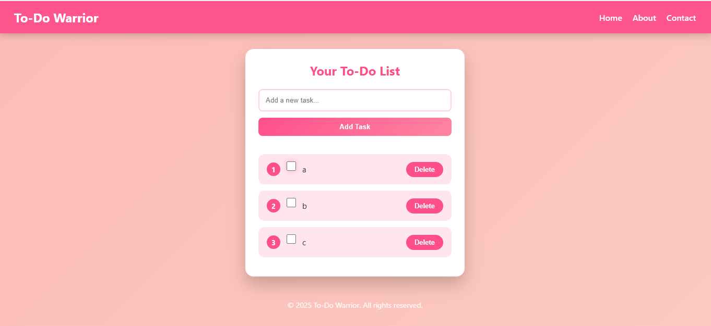
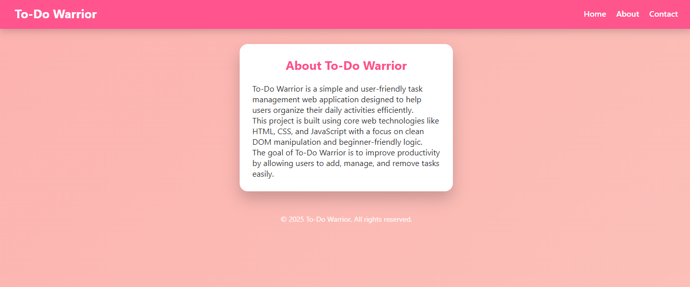

# 📝 To-Do Warrior

A simple, clean, and responsive **To-Do List web application** built using **HTML, CSS, and JavaScript**.  
This project helps users add, mark, and delete tasks with a smooth and modern UI.

---

## 📸 Screenshots

### Home – To-Do List



### About Page


---

## 🚀 Features

- ➕ Add new tasks
- ✅ Mark tasks as completed / not completed
- ❌ Delete tasks
- 🔢 Automatic numbering of tasks
- 🎨 Animated pink theme UI
- 📱 Fully responsive (mobile & desktop)
- 🧠 Clean DOM manipulation (no libraries)

---

## 🛠️ Technologies Used

- **HTML5**
- **CSS3**
- **JavaScript (Vanilla JS)**
- **Git & GitHub**

---

## 📂 Project Structure

```
To-Do/
├── index.html
├── about.html
├── contact.html
├── styles.css
├── app.js
├── screenshots/
│   ├── todo-home.png
│   └── todo-about.png
└── README.md
```

---

## ⚙️ How to Run

Open `index.html` in your browser.  
No server required.

---

## 👤 Author

**Mantu Gupta**  
Frontend / Full-Stack Web Developer

---

⭐ If you like this project, give it a star on GitHub!
